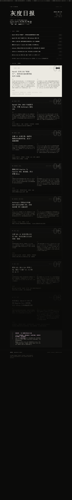

# 灰度日报 · GRAYSCALE AI DAILY

收集最新 AI 资讯，重点覆盖 OpenAI、Google、Microsoft、Anthropic、百度、腾讯、知乎、微博、微信公众号等公开渠道；每条资讯均经多源交叉核验，再按「时间 · 背景 · 内容 · 来源渠道」提炼为 5–8 条精读。

## 在线访问

<https://xiaotian95.github.io/xiaotian59/>

## 本期预览

## 文件说明

- `index.html` — 最新一期页面（站点首页）
- `ai-daily-2026-08-24.html` — 2026-08-24 期存档
- `preview-2026-08-24.png` — 本期预览图

## 免责声明

内容基于公开报道整理，仅供信息参考，不构成投资建议；部分涉及预测与传闻的信息以官方公告为准。
